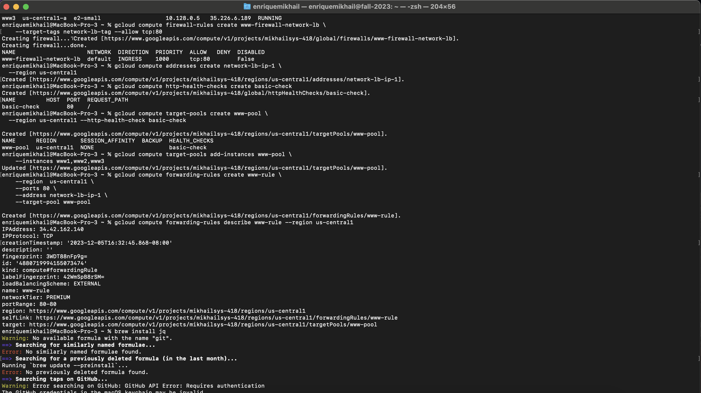
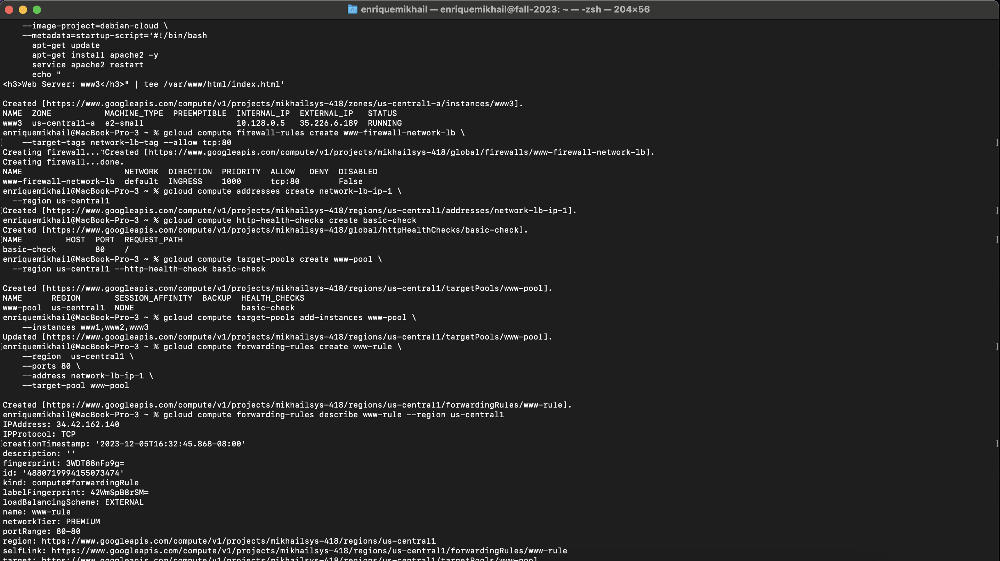
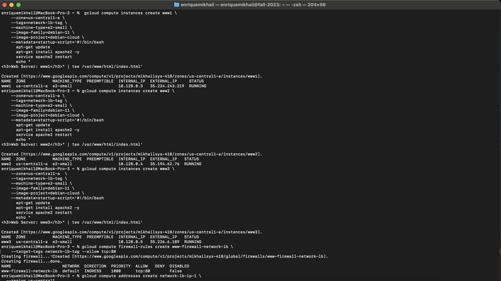
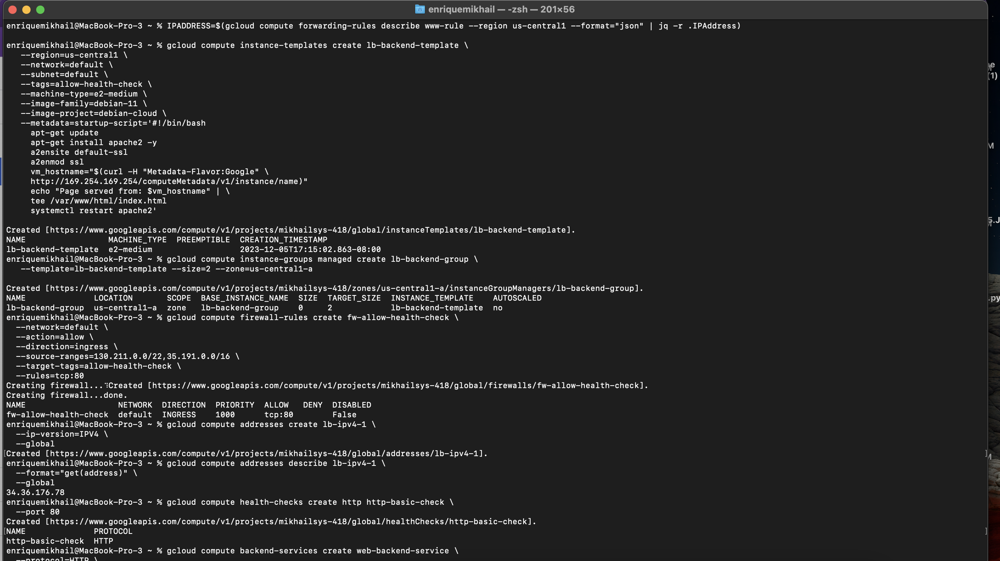
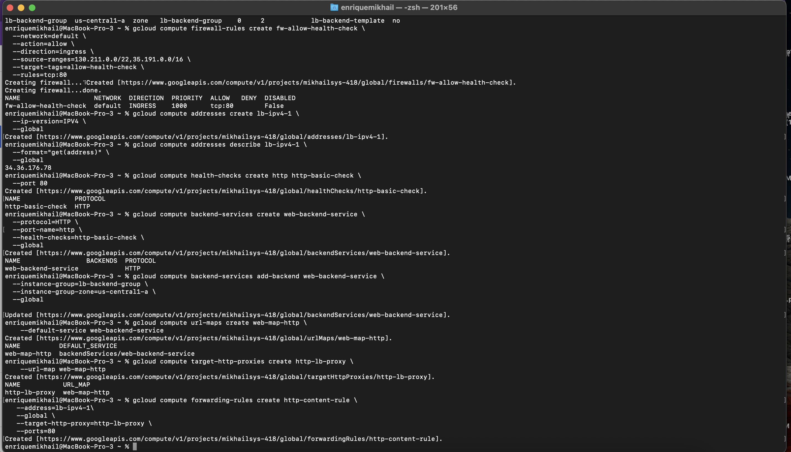
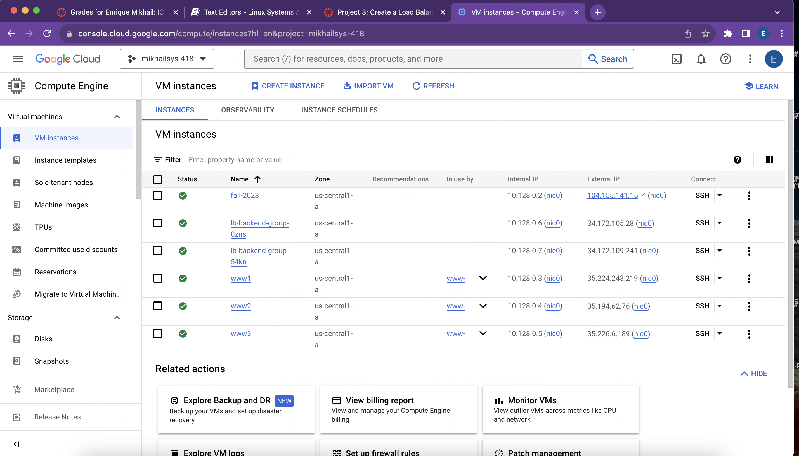

## Notes 
I began by following the commands in the video you provided us with in the assignment so I could get familiar with the commands. I didnt have to create a virtual machine on terminal because I already had practiced the commands to create a virtual. I realized I had to put the zone in for most of the steps or else my code wouldnt work. I followed Instructions on the google website and installed all 3 new virtual machines; WWW1 WWW2 WWW3. After that I kept follwoing the commands and realized homebrew was not installed on my computer. Install homebrew and waiting for the download took forver because I had to free up space on my laptop and wait for the download. After that I installed the firewall and was able to continue on to the next steps. shortly afer this my load balancer was completed. I tested it on my browser and everything seemed to be working fine. Below I have attached my screenshotsof terminal and Virtual machine instances. Although there was surely more steps invovled in completing this the screenshots do a better job of showcasing that. 

## Terminal Screenshots 

